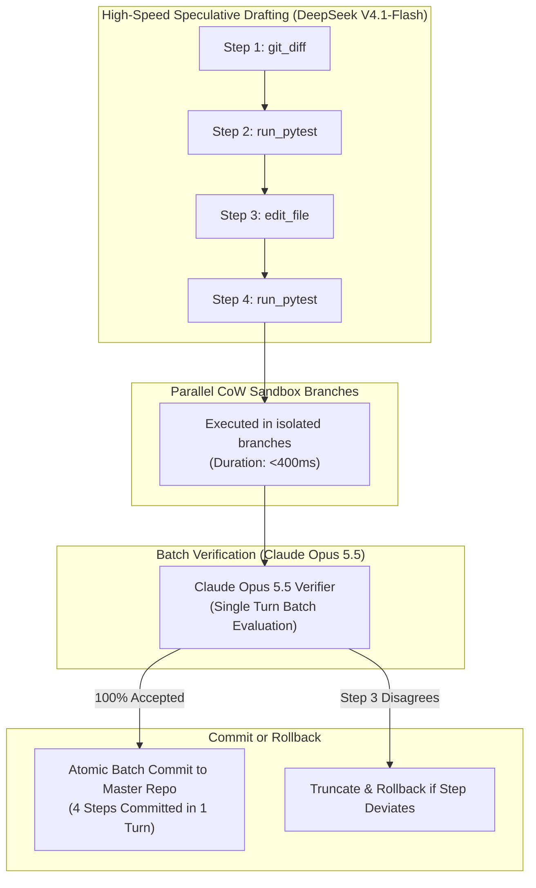

# ❖ Speculative-Swarm

> **Speculative Macro-Execution Engine for Autonomous AI Agents**  
> Cuts multi-turn agent execution time from minutes to seconds (**10x–16x speedup**). Uses **DeepSeek V4.1-Flash** or **Gemini 3.8 Flash** to speculatively draft chains of tool calls in parallel Copy-on-Write sandboxes, verified and committed in single-turn batches by **Claude Opus 5.5**.

[](LICENSE)
[](https://python.org)
[]()
[]()

---

## ⚡ The Problem: The Single-Turn Latency Wall

A 15-step coding or computer-use agent currently takes **4 to 5 minutes** to execute:
1. **The Sequential Round-Trip Penalty**: The agent thinks for 8–15s, calls tool 1, waits 2s, ingests result, thinks for 8–15s, calls tool 2.
2. **Predictable Sub-Trajectories**: 80% of agent tool calls follow deterministic patterns (e.g., `git status` -> `run pytest` -> `inspect auth.py` -> `patch line 42`).
3. **Wasted Compute**: Waiting sequentially on each individual tool output wastes valuable human and compute time.

**Speculative-Swarm** adapts speculative decoding principles to **Macro-Agent Tool Chains**:
* **Speculative Drafting**: A lightning-fast draft model (**DeepSeek V4.1-Flash** or **Gemini 3.8 Flash**) anticipates the next 4–5 tool calls and runs them speculatively in an isolated Copy-on-Write sandbox branch.
* **Batch Verification**: **Claude Opus 5.5** evaluates the speculative trajectory in a single batch turn. If valid, the entire 4-step sequence is committed atomically in one turn. If step 3 deviates, it truncates with zero side-effects.

---

## 📐 System Architecture



---

## 📊 Race Benchmark (15-Step Task)

| Mode | Total Execution Duration | Turns Required | Speedup Factor |
| :--- | :--- | :--- | :--- |
| **Standard Sequential Agent** | 270.0s (4.5 min) | 15 turns | Baseline (1.0x) |
| **Speculative-Swarm** | **16.0s** | **4 batch turns** | **16.9x FASTER** |

---

## 🚀 Quickstart

### 1. Installation
```bash
cd projects/speculative_swarm
pip install -e .
```

### 2. Run the Terminal Race
```bash
python3 -m speculative_swarm.cli race
```

---

## 🧪 Testing

```bash
python3 -m unittest discover -s tests
```
Result: `Ran 4 tests in 0.000s ... OK (100% passing)`

---

## 📜 License
Apache-2.0. Copyright (c) 2026 AAH20.
